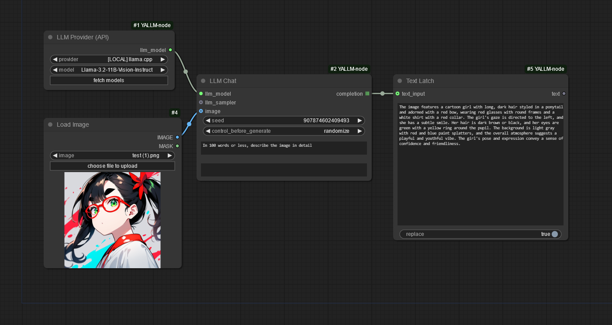

# Yet Another LLM Node (for ComfyUI)

Yet another set of LLM nodes for [ComfyUI](https://github.com/comfyanonymous/ComfyUI). This one only supports OpenAI-like APIs, but of course can be used with local LLM providers such as [llama.cpp](https://github.com/ggerganov/llama.cpp) (and ollama, LM Studio, among many others).

This project mainly served as an exercise in creating ComfyUI nodes.

## Features

* Connection profiles are defined externally in `models.yaml`, optionally pulling API URLs & API keys from environment variables.

   Since they're externally defined, there's no chance for your precious API keys to leak via workflow metadata.
* Only uses the chat completion API endpoint. No messing around with prompt templates.
* Can set a system prompt.
* The usual set of LLM samplers (temperature, top-k, top-p, min-p)

   For llama.cpp at least, the order you chain them together affects their order of application. (Other llama.cpp-derived providers might also respect the `samplers` option.)

   Also note that the OpenAI API spec only officially supports temperature and top-p, so what's actually supported will depend on your provider.
* Seed is exposed and configurable, allowing some degree of determinism.
* Can optionally pass in an image and query the LLM about it. Of course this means the LLM at your remote API needs to support images. Also be mindful that some VLMs like Llama 3.2 Vision don't support a system prompt when prompting with an image. (Some providers will just silently fail!)

Aside from adding more samplers (as requested/as I need them), I consider this project feature complete.

Though don't be surprised if I start adding RAG features or something in the future.

## Installation

Clone this project into your `custom_nodes` directory.

Then within the `ComfyUI-YALLM-node` directory:

    cp models.yaml.example models.yaml

and edit `models.yaml` if you would like to use more than just the `http://localhost:8080/v1` endpoint.

Finally, install the dependencies:

    pip install -r requirements.txt

or

    path/to/ComfyUI/python_embeded/python -m pip install -r requirements.txt

Just make sure `pip`/`python` is the same one used for your ComfyUI installation.

## "LLM Provider" Node

As an alternative to the "LLM Model" node (where you map "virtual" models to API providers+models), there is also an "LLM Provider" node. This node is a low-setup alternative, as you only have to define providers/connections. The available models are fetched dynamically, allowing you to make a selection in the UI.

To configure it, from within the `ComfyUI-YALLM-node` directory:

    cp providers.yaml.example providers.yaml

and then edit `providers.yaml` to taste. It is very similar to `models.yaml` and has the same features, such as environment variable substitution.

You can then use the "LLM Provider" node in place of "LLM Model", like so:

When you click the "fetch models" button, or select a different provider, a query will be made to the currently selected provider's `/v1/models` API endpoint. Note: The node will error out (intentionally) if this hasn't been done successfully at least once.

## "Text Latch" Node

This is basically "Show Text" with memory. Whenever the node is executed, if there is an input and if the "replace" switch is true, the incoming string will replace the contents of the textbox.

The input is optional, meaning you can mute the node leading into it or even disconnect it.

The node will output whatever is currently being displayed in the textbox. The node text will also be saved in exported workflows and generated images.

## My Related Projects

* https://github.com/asaddi/YALLM-LlamaVision Basic ComfyUI node for Llama 3.2 Vision. Sampler/model nodes are cross-compatible with this project.

## License

Licensed under [BSD-2-Clause-Patent](https://opensource.org/license/bsdpluspatent).
